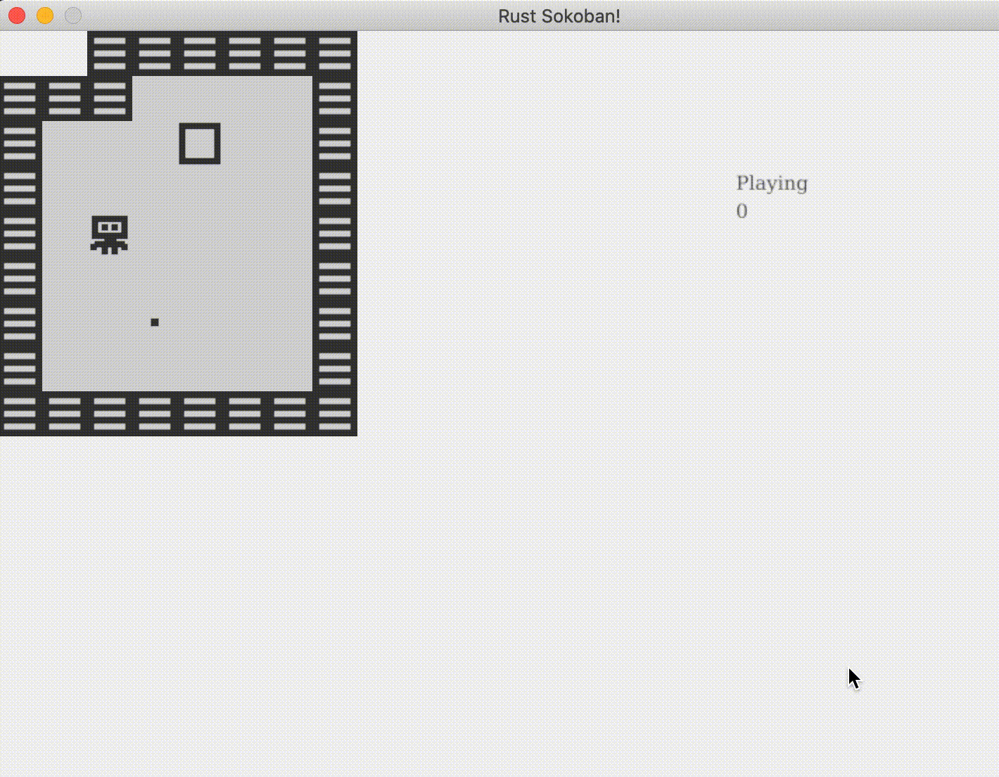

# 实现游戏基本功能

现在角色可以推动箱子在区域内移动了．有些（并不是全部）游戏还会设定些目标让玩家去完成．比如有些推箱子类的游戏会让玩家把箱子推到特定的点才算赢．目前我们还没实现类似的功能，还没有检查什么时候玩家赢了并停止游戏，有可能玩家已经把箱子推到目标点了，但我们的游戏并没意识到．接下来就让我们完成这些功能吧!

首先我们需要想一下要检查是否赢了并通知玩家需要添加那些功能．
当玩家闯关时:

- 需要一个用于保存游戏状态的 `resource` 
    - 游戏是在进行中还是已经完成了?
    - 玩家目前一共走了多少步了?
- 需要一个用于检查玩家是否完成任务的`system` 
- 需要一个用于更新移动步数的 `system` 
- 需要一个用于展示游戏状态的界面（UI ）

## 游戏状态资源

我们之所以选择使用`资源（resource）`保存游戏状态，是因为游戏状态信息不跟任何一个实体绑定.接下来我们就开始定义一个`Gameplay`资源．

```rust
// resources.rs
{{#include ../../../code/rust-sokoban-c02-05/src/resources.rs:38:43}}
```

`Gameplay` 有俩个属性: `state` 和 `moves_count`. 分别用于保存当前游戏状态(当前游戏正在进行还是已经有了赢家)和玩家操作的步数． `state` 是`枚举（enum）`类型, 可以这样定义:

```rust
// resources.rs
{{#include ../../../code/rust-sokoban-c02-05/src/resources.rs:17:20}}
```

眼尖的你应该已经发现，我们使用了宏为`Gameplay`实现了`Default`特征，但是枚举`GameplayState`却没有.如果我们需要把`Gameplay`用做资源，那它必须具备`Default`特征．Rust并没有提供为枚举类型实现`Default`特征的宏，我们只能自己为枚举`GameplayState`实现`Default`特征了.

```rust
// resources.rs
{{#include ../../../code/rust-sokoban-c02-05/src/resources.rs:32:36}}
```

定义好资源别忘了注册下:

```rust
// resources.rs
{{#include ../../../code/rust-sokoban-c02-05/src/resources.rs:12:15}}
```

当游戏开始时，资源`Gameplay`应该是这样地：

```rust
Gameplay {
    state: GameplayState::Playing,
    moves_count: 0
}
```

## 计步System

我们可以通过增加`Gameplay`的`moves_count`属性值来记录玩家操作的步数.

可以在先前定义的处理用户输入的`InputSystem`中实现计步的功能．因为我们需要在`InputSystem`中修改`Gameplay`的属性值，所以需要在`InputSystem`中定义`SystemData`类型时使用`Write<'a, Gameplay>`.

```rust
// input_system.rs
{{#include ../../../code/rust-sokoban-c02-05/src/systems/input_system.rs:0:25}}
        ...
```

我们先前已经编写过根据玩家按键移动角色的代码，在此基础上再添加增加操作步骤计数的代码就可以了．

```rust
// input_system.rs
        ...
{{#include ../../../code/rust-sokoban-c02-05/src/systems/input_system.rs:83:105}}
```

## Gameplay System

接下来是添加一个`GamePlayStateSystem`用于检查所有的箱子是否已经推到了目标点，如果已经推到了就赢了．除了 `Gameplay`, 要完成这个功能还需要只读访问`Position`, `Box`, 和 `BoxSpot`.这里使用 `Join`  结合`Box（箱子）` 和 `Position（位置）`创建一个包含每个箱子位置信息的`Vector`（集合）.我们只需要遍历这个集合判断每个箱子是否在目标点上，如果在就胜利了，如果不在游戏继续.

```rust
// gameplay_state_system.rs
{{#include ../../../code/rust-sokoban-c02-05/src/systems/gameplay_state_system.rs::}}
```

最后还需要在渲染循环中执行我们的代码:

```rust
// main.rs
{{#include ../../../code/rust-sokoban-c02-05/src/main.rs:24:39}}
    // ...
{{#include ../../../code/rust-sokoban-c02-05/src/main.rs:63}}
```


## 游戏信息界面

最后一步是需要提供一个向玩家展示当前游戏状态的界面.我们需要一个用于记录游戏状态的资源和一个更新状态信息的System.可以把这些放到资源`GameplayState`和`RenderingSystem`中．

首先需要为`GameplayState`实现Display特征，这样才能以文本的形式展示游戏状态．这里又用到了模式匹配，根据游戏的状态显示"Playing(进行中)"或"Won（赢了）".

```rust
// resources.rs
{{#include ../../../code/rust-sokoban-c02-05/src/resources.rs:21:30}}
```

接下来我们需要在`RenderingSystem`中添加一个方法`draw_text`,这样它就可以把游戏状态信息`GameplayState`显示到屏幕上了.

```rust
// rendering_systems.rs
{{#include ../../../code/rust-sokoban-c02-05/src/systems/rendering_system.rs:16:32}}
```

...为了调用`drwa_text`我们还需要把资源 `Gameplay` 添加 `RenderingSystem` 中，这样 `RenderingSystem` 才能获取到资源 `Gameplay`．

```rust
// rendering_system.rs
{{#include ../../../code/rust-sokoban-c02-05/src/systems/rendering_system.rs:35:71}}
```

至此我们编写的推箱子游戏已经可以向玩家展示基本的信息了:

- 当前的操作步数
- 当玩家胜利时告诉他们

看起来就像这个样子：




还有很多可以改进增强的!

> **_CODELINK:_**  点 [这里](https://github.com/iolivia/rust-sokoban/tree/master/code/rust-sokoban-c02-05)获取目前的完整代码.

